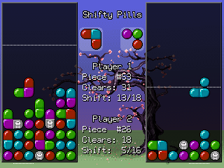

# Shifty Pills

About
-----
Shifty Pills is a tile-matching action puzzle game.

Game rules
----------
Line up 3 or more pills of a matching color in order to clear them.

Authors
-------
* Programming, fonts & game idea - [Artur Rojek (zear)](mailto:contact@artur-rojek.eu)
* Graphics - [vergeofapathy](mailto:stephan@vergeofapathy.com)

License
-------
* Source code - [MIT License](MIT.txt)
* Graphics - [CC BY 4.0](https://creativecommons.org/licenses/by/4.0/)
* Fonts - [CC0 1.0 Universal](https://creativecommons.org/publicdomain/zero/1.0/)

Code contributions & porting
----------------------------
At this early point of game development, code contributions will generally not be accepted.
If you plan to port Shifty Pills to a new platform, please withhold until a more complete game version is available.
