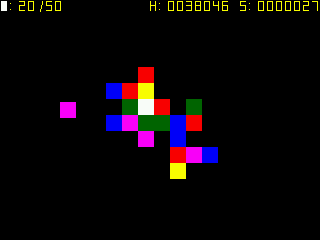

TripleTrapled
=============

Triple Trapled is a remake of "Triple Traple" by ABA Games.

* Author: Artur Rojek (zear)
* License: MIT (see LICENSE.txt)

Special thanks:
* Kenta Cho - original game idea
* Nebuleon - game testing
* Senquack - game testing

Instructions:
-------------
* Connect 3 blocks of the same color to break the chain.
* Multiply your score by the number of additional blocks destroyed with the chain.
* Use the blinking block to remove a single block of any color.
* Every 5 seconds the game speed increases.
* Game ends when the number of stacked blocks on the level reaches 50.

Changelog:
----------
2014/12/31, v0.9
* initial game release
